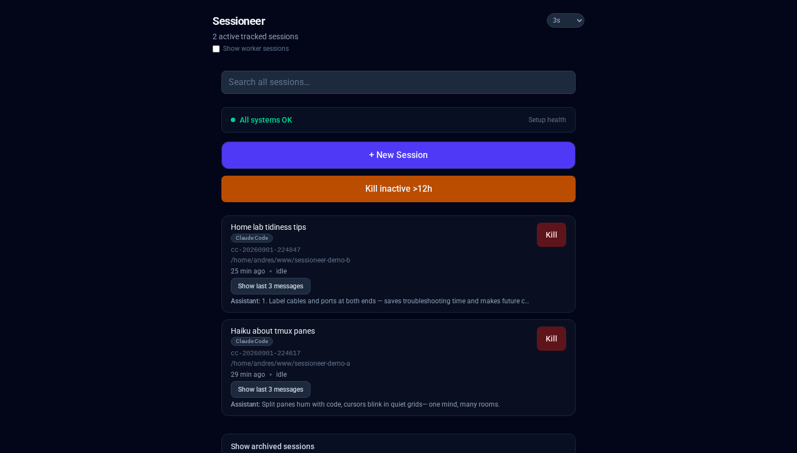

# Sessioneer

A self-hosted, LAN-only web UI for managing tmux sessions running Claude
Code, Codex, OpenCode, and Antigravity (`cc-*`, `cx-*`, `oc-*`, `ag-*`) on
your own dev box - see blocked prompts, answer them, send messages, view
transcripts, and kill sessions, all from a phone or any browser on your
network. No database, no user accounts - access control is the network
binding, not a login.

> **Note on scope**: this project's primary author runs it as a personal
> tool on their own machine, so day-to-day development is driven by that
> use case. It's shared here as a working example and a starting point for
> your own setup, not as a polished, actively-triaged public product -
> issues and PRs are welcome (see [CONTRIBUTING.md](CONTRIBUTING.md)), but
> treat it as "read the code, adapt it" rather than "install and forget."

## Screenshot



Shown with two throwaway demo sessions (generic prompts, no real project data) —
day-to-day the list is whatever `cc-*`/`cx-*`/`oc-*`/`ag-*` tmux sessions (Claude
Code, Codex, OpenCode, Antigravity) are actually running on your box.

## What it does

> For the exhaustive capability list and the per-agent coverage matrix
> (which agents support which feature, and where parity is partial), see
> [`docs/features.md`](docs/features.md).

- Lists `cc-*` tmux sessions: name/title, working directory, relative
  last-active time, attached/detached, live context-usage percentage.
- **Blocked-on-input warning**: if a session's pane is currently showing an
  interactive prompt Claude Code needs a human for (folder trust on first
  launch in a new directory, tool-permission approval, a question, ...),
  the row shows what it's waiting on, with real Approve/Deny-style buttons
  to answer it right from the browser - or a copy-pasteable `tmux attach`
  command if you'd rather answer by hand. Detected via the leading `❯ N.`
  cursor Claude Code renders on every such prompt's selected option, not by
  matching specific prompt wording.
- **Session transcript view**: scroll a session's real conversation history
  - user/assistant messages, tool calls and their outputs (grouped into
  collapsible "N tool calls" runs so a long tool-heavy stretch doesn't
  spam the page), subagent calls/reports, plan presentations - with live
  polling for new messages while you watch, and a compose box to send a
  new message or answer a prompt without attaching to tmux at all. Every
  message and tool call/output has a Copy button.
- **Search**: a dashboard-wide search box finds a session by anything
  actually said inside it (not just its title), across live and archived
  transcripts alike; a per-session search box does the same within just
  that conversation, including older history you haven't scrolled to yet.
  Either one jumps straight to the matching point in the transcript.
- Also lists any other real `claude` process found on the host that isn't
  inside a `cc-*` session this tool manages (started by hand in a plain
  terminal, for example) - killable, and adoptable into a tracked session
  via "Take over."
- **New Session**: prompts for a working directory (a browsable folder
  picker rooted at your configured project directory) and starts a new
  tracked `claude` session there.
- **Archived sessions**: browse and resume past, no-longer-running sessions
  Claude Code still has a transcript for, read-only until resumed.
- No required auto-refresh - polls while a tab is visible, pauses in the
  background; a manual Refresh button always works too.
- **Usage quota footer**: session/weekly usage percentages and reset
  countdowns, read straight from Claude Code's own statusLine JSON via a
  small marker this app appends to your statusLine script - no external
  scraper needed, shows "Quota unavailable" until at least one session has
  rendered its status line once with the marker installed.
- **Web Push notifications**: get notified on your phone when a session
  needs input or finishes a long task, even with the tab closed - see "Web
  Push notifications" below.

## Architecture, in short

The web UI runs in a Docker container that **never touches tmux or the
host process table directly** - it only speaks a small JSON
request/response protocol over a UNIX socket to a separate, host-native
**agent** (`host-agent/`, installed directly on the host, not
containerized) that owns tmux, `/proc` scanning, and everything else that
has to run in the host's own namespace. This split exists so the container
can never accidentally become the process that spawns tmux's own server
(which would put it inside the container's filesystem namespace,
unreachable from the host) - see [CONTRIBUTING.md](CONTRIBUTING.md) for
the full story and the rest of the architecture.

Practically, this means **setup has two independent parts**: the host
agent (native, via systemd `--user`) and the container (Docker). The host
agent must be installed and running *before* the container starts.

## Major implementation decisions

- **Container/host-agent split exists for one specific reason**: tmux auto-spawns its
  server as a child of whichever process first talks to an unstarted socket. If the
  container were that first process, the tmux server (and every session in it) would be
  born inside the container's own filesystem namespace — unreachable from the host, and
  pointing at paths that don't exist there. Keeping all tmux/`/proc` access in a process
  that's always host-native makes that impossible by construction, not by convention.
- **Session state (blocked/working/idle) comes exclusively from Claude Code's own hooks,
  not from scraping the tmux pane**, for every prompt shape except two structural
  exceptions (the initial folder-trust dialog, and a single-question `AskUserQuestion`'s
  content). A session with no hooks installed just reports unknown/idle rather than
  falling back to guessing from rendered pane text — more predictable than a
  "prefer this, degrade to that" cascade, at the cost of needing the hooks installed at all.
- **Every command runs via `proc_open()` with the command as an array, never a shell
  string** — this isn't a hardening pass bolted on after the fact, it's the only way any
  command in this codebase is ever invoked, which rules out shell metacharacter injection
  by construction rather than by escaping.
- **`public/js/*.js` is deliberately plain ES5** (no `const`/`let`/arrow functions/template
  literals) — mobile Safari compatibility issues were the repeated reason, since this is a
  PWA meant to be added to an iOS/Android home screen.

## Requirements

- Linux with `tmux`, PHP 8.1+ (with the `pdo_sqlite` extension enabled -
  `php -m | grep sqlite`), Composer, and Docker/Docker Compose.
- systemd with user services (`systemd --user`) for the host agent.
- [Claude Code](https://claude.com/claude-code) itself, obviously - this
  manages `claude` CLI sessions, it doesn't run Claude Code for you.

## Setup

**Order matters: install and start the host agent *before* starting the
container.** Docker bind-mounts a source path that doesn't exist yet as an
empty directory, so if the container starts first, the agent socket path
inside the container will silently be a directory instead of the real
socket, and everything will fail with "Cannot reach host agent."

1. Install the host agent (runs natively via systemd `--user`, needs no
   containers):
   ```
   ./host-agent/install.sh
   ```
   This installs Composer dependencies if needed, copies `host-agent/
   .env.example` to `host-agent/.env` if you don't already have one, and
   installs + enables the systemd socket unit (the push-notification timer
   is also installed here but deliberately left disabled - see "Web Push
   notifications" below). It'll warn if `CLAUDE_BIN` isn't set yet - run
   `which claude` and put the result in `host-agent/.env`.

   Verify the socket exists and is a socket (`s` in `ls -la`), not a
   directory:
   ```
   ls -la $XDG_RUNTIME_DIR/sessioneer-agent.sock
   ```
   Lingering must be enabled for the socket to survive logout/reboot
   without an active login session - `install.sh` checks this and prints
   the fix if not.

2. `cp .env.example .env` and fill in:
   - `APP_GID` - must match the group the installer set on the agent
     socket (`install.sh` prints the exact gid to use at the end of its
     output). `APP_UID` doesn't need to match a specific host user - the
     container never touches the host filesystem or tmux directly, only
     the agent socket.
   - `SESSIONEER_AGENT_SOCKET_HOST` - path to the real socket from step 1,
     normally `/run/user/<your-uid>/sessioneer-agent.sock`.
   - `BIND_ADDR` / `APP_PORT` - see "Network binding" below.

3. Build and start the container:
   ```
   docker compose up -d --build
   ```
   Leave it running. Only re-run this if you change `docker-compose.yml`
   itself; plain PHP/JS edits under `src/`/`public/` never need a rebuild
   (see [CONTRIBUTING.md](CONTRIBUTING.md)).

4. Visit `http://<BIND_ADDR>:<APP_PORT>/`.

5. The dashboard checks on every load whether Claude Code's `SessionStart`,
   `PreToolUse`, `PermissionRequest`, `UserPromptSubmit`, and `Stop` hooks
   are all registered in `~/.claude/settings.json`, and shows a banner with
   an "Install hooks" button if any is missing - click it, it's a one-time,
   safe merge into your existing settings (your own hooks for the same
   events, if any, are left in place alongside these). All five are
   required for the app to work correctly - without them, transcripts can
   go stale after `/clear`/`/compact`/`--resume`, blocked-prompt previews
   can be cut short, and a session's working/mode/blocked status may not
   show up at all - see [CONTRIBUTING.md](CONTRIBUTING.md) for why each
   hook exists.

**Deploying behind a real web server instead of `php -S`**: point its
document root at `public/`, nothing else. Apache: enable `mod_rewrite` and
use `public/.htaccess` as-is. nginx: add the equivalent of
```nginx
location / {
    try_files $uri $uri/ /index.php?$query_string;
}
```

## Configuration (host agent)

`host-agent/lib/Services/Config.php` reads these from the environment (via
`host-agent/.env`, loaded by the systemd unit). Only `CLAUDE_BIN` is truly
required - everything else either has a sensible environment-derived
default (your real `$HOME`, your real uid) or is optional:

| Variable                    | Default                                       | Meaning                                    |
|------------------------------|-----------------------------------------------|---------------------------------------------|
| `CLAUDE_BIN`                 | *(required, no default)*                      | Real claude CLI path (`argv[0]` must match) |
| `WWW_ROOT`                   | `HOME_ROOT`                                   | Starting folder for the New Session browser |
| `HOME_ROOT`                  | your real `$HOME`                             | Upper bound the folder browser can't escape |
| `TMUX_SOCKET`                | `/tmp/tmux-<uid>/default`                     | tmux socket this agent drives (`-S`)        |
| `SIDECAR_DIR`                | `/run/user/<uid>/sessioneer-sessions`                | Per-session workdir/spawned_at metadata     |
| `CLEANUP_THRESHOLD_SECONDS`  | `43200` (12h)                                 | Inactivity threshold for "Kill inactive"    |
| `QUOTA_LIVE_STATE_FILE`      | `host-agent/state/quota-live-state.json`      | Where the statusline marker writes quota    |

See `host-agent/.env.example` for the complete list, including the Web
Push-related variables covered below.

## Network binding (read this)

There is **no login** - the network binding *is* the access control. This
app is intentionally **not** meant to be reachable from the public
internet - it can create and kill tmux sessions on your machine.

- `docker-compose.yml` publishes the port as
  `"${BIND_ADDR}:${APP_PORT}:80"`. Set `BIND_ADDR` in `.env` to your
  machine's actual **LAN IP** (e.g. `192.168.1.50`), never `0.0.0.0`. Leave
  it at the default `127.0.0.1` if you only want to reach it from the host
  itself (e.g. via an SSH tunnel).
- If you put a reverse proxy in front of it, make sure **that proxy** is
  also LAN-only - it's easy to have this app's own bind address correctly
  restricted while an existing shared reverse proxy in front of it is
  bound more broadly, silently exposing this app anyway.
- Consider a host firewall rule (`iptables`/`ufw`/`nftables`) restricting
  inbound `APP_PORT` to your LAN subnet as defense in depth.

## Home screen bookmark

On a phone on the same LAN, open `http://<BIND_ADDR>:<APP_PORT>/` (or your
own HTTPS URL if you've set one up - required for Web Push, see below) and
use "Add to Home Screen" (Safari: Share → Add to Home Screen; Chrome: ⋮
menu → Add to Home Screen).

## Web Push notifications

Lets a session's newly-blocked prompt reach your phone without the tab
open and polling. Off by default on a fresh checkout (no VAPID keys, no
timer running) - every piece is a harmless no-op until you opt in.

0. **Requires HTTPS - a hard platform requirement, not optional.** Service
   Workers (what Web Push is built on) are blocked entirely by the browser
   outside a secure context - plain `http://` never works for this
   specifically, silently (no error, the "Enable notifications" button
   just never appears). You need some way to serve this app over HTTPS
   with a certificate your phone trusts - a reverse proxy (Traefik, Caddy,
   nginx) with either a real certificate (Let's Encrypt, if this is
   reachable enough for that - unlikely for a LAN-only app) or a
   self-signed one you manually trust on your device works.

   If you go the self-signed route on iOS specifically: a "proceed
   anyway" click through Safari's own warning page does **not** carry over
   to a home-screen-installed app's separate WebView context - you need to
   actually install the certificate as a trusted profile (AirDrop/email
   yourself the `.crt`, not the `.key`; Settings will offer "Install
   Profile"; then separately enable full trust for it under Settings →
   General → About → Certificate Trust Settings). Keep the cert's validity
   under 398 days if you want it to be trustable via iOS's Certificate
   Trust Settings at all - Apple caps it there, and a longer-lived cert
   will silently never be trustable that way.

1. **Generate a VAPID keypair** (one-time, on the host):
   ```
   php -r "require 'vendor/autoload.php'; print_r(Minishlink\WebPush\VAPID::createVapidKeys());"
   ```
2. Put the two resulting keys, plus a contact address, in `host-agent/.env`:
   ```
   VAPID_PUBLIC_KEY=...
   VAPID_PRIVATE_KEY=...
   VAPID_SUBJECT=mailto:you@example.com
   ```
3. Reload the page in the browser you want notifications on and tap
   "Enable notifications" (only appears once the keys above are set).
   Requires the site to already be added to the home screen first - iOS
   Safari only exposes the Push API to a home-screen-launched PWA, not a
   regular browser tab.
4. Enable the timer that actually checks for newly-blocked sessions and
   sends the pushes (installed but left disabled by `install.sh`, since
   starting a new recurring background service deserves a deliberate
   opt-in):
   ```
   systemctl --user enable --now sessioneer-push-check.timer
   ```

**iOS's subscription lifecycle is flaky, by design of the platform, not a
bug here**: a subscription can silently die after roughly 1-2 weeks. The
frontend's own mitigation: every page load with an existing subscription
silently re-POSTs it to stay fresh, so simply opening the app periodically
self-heals a subscription that's started to go stale.

See [CONTRIBUTING.md](CONTRIBUTING.md) for the full push-delivery
mechanism, notification-content details, and the quota-push variant.

## Running tests

```
bash tests/run.sh          # run every test file
bash tests/run.sh --bail   # stop at the first failing test file
```

No Composer test runner needed - plain PHP scripts driven by a bash
entrypoint. The suite is fully isolated from your real tmux
sessions/processes (a separate tmux server, a fixture `claude` binary,
never the real billable CLI) - see [CONTRIBUTING.md](CONTRIBUTING.md) for
the isolation mechanism and what each test file covers.

## Security summary

- No login - access control is the network binding (see "Network binding"
  above).
- No free-text fields except the optional custom working-directory path
  for New Session, which is passed as a `proc_open()` array argument
  (never through a shell) and only ever used as a `tmux -c` target - it
  can change *where* the fixed `claude` command starts, not *what*
  command runs.
- Every state-changing POST is guarded twice: a same-origin check
  (`Origin`/`Referer` vs `Host`) and a session-bound CSRF token, checked
  with `hash_equals()`.
- Every session name/pid the app can act on is re-validated against a
  fresh listing computed in the same request, never trusted from the
  client.
- The container has no access to the host filesystem, tmux, or the
  process table - only a single UNIX socket to the host agent, gated
  further by UNIX socket permissions.
- No database, no persistent state beyond a PHP session (a CSRF token and
  the next flash message) and small JSON sidecar files recording which
  working directory a session was started with.

See [CONTRIBUTING.md](CONTRIBUTING.md) for how commands are actually
built/run (the `proc_open()` array-form convention that rules out shell
injection entirely) and the full architecture.

## Current limitations

- No accounts, no multi-user support — this is a single-operator tool for one person's
  own dev box, gated by network binding, not a login (see "Network binding" above).
- Only manages `cc-*` tmux sessions on the same host the container and host agent run
  on — no remote/multi-host session management.
- Feature parity across agents (Claude Code, Antigravity, OpenCode, Codex) is partial —
  see [`docs/features.md`](docs/features.md) for the exact per-agent coverage matrix.
- Web Push on iOS is inherently flaky (a platform limitation, not a bug here) — a
  subscription can silently die after 1-2 weeks; see "Web Push notifications" above.
- No test coverage for the frontend JS itself — `tests/` covers the PHP backend and
  host agent; browser-side behavior is verified manually.

## Contributing

See [CONTRIBUTING.md](CONTRIBUTING.md) for the architecture deep-dive, file
structure, hook rationale, development workflow, and testing details.

## License

[MIT](LICENSE)
